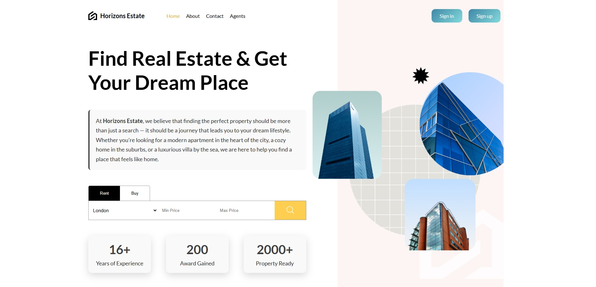
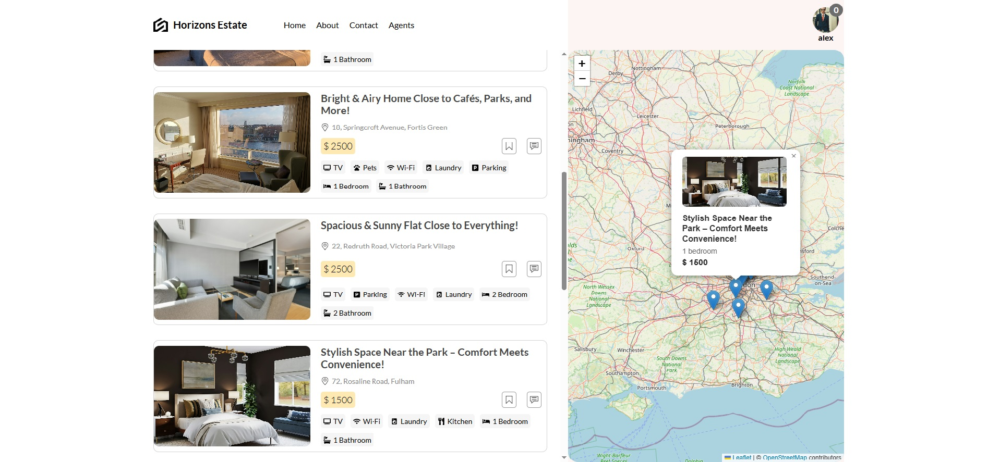
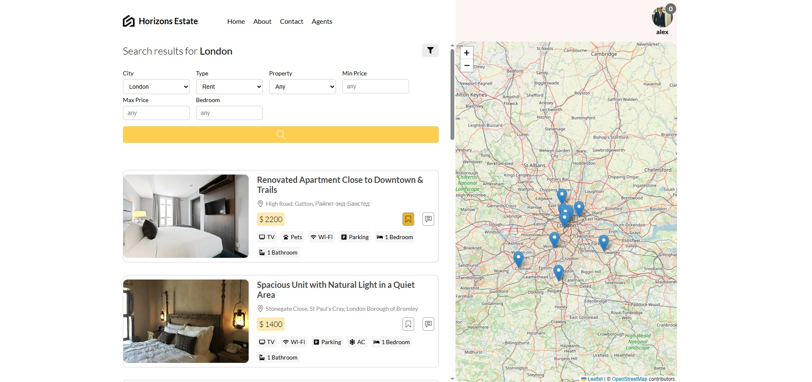
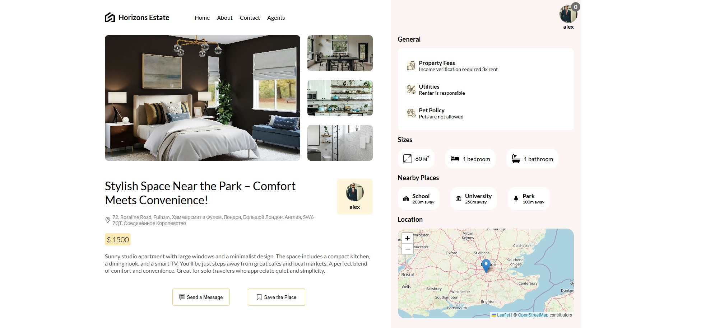
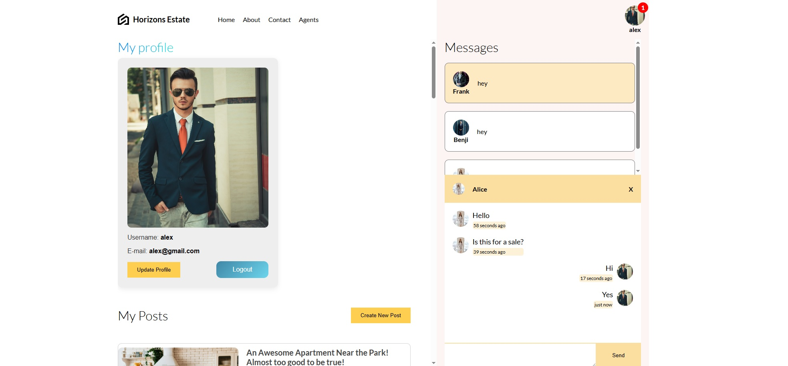
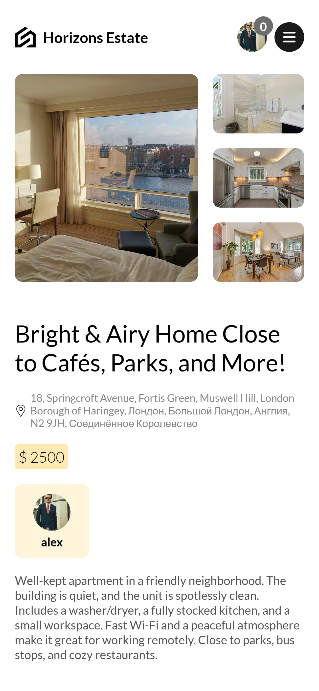
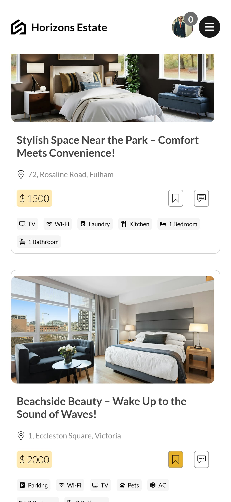
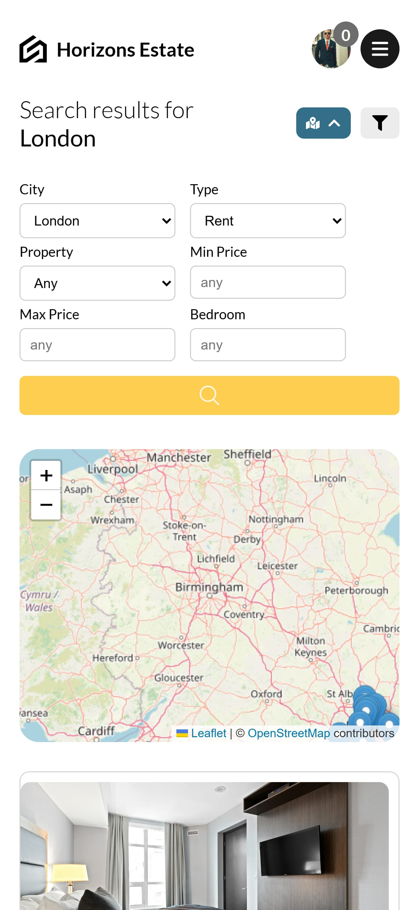
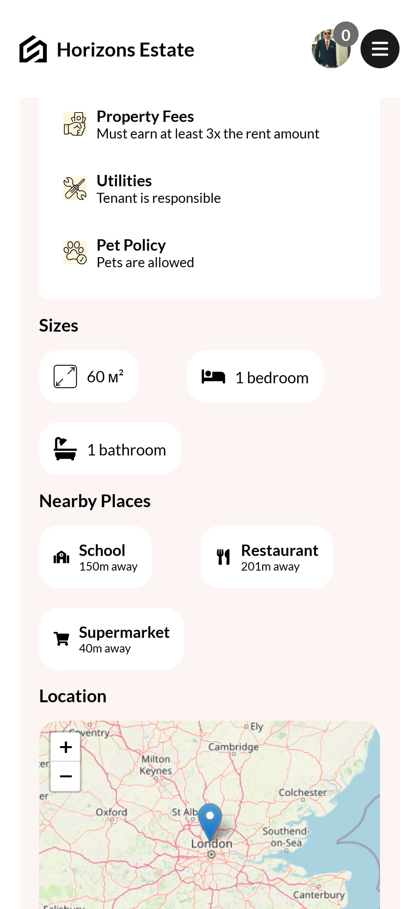
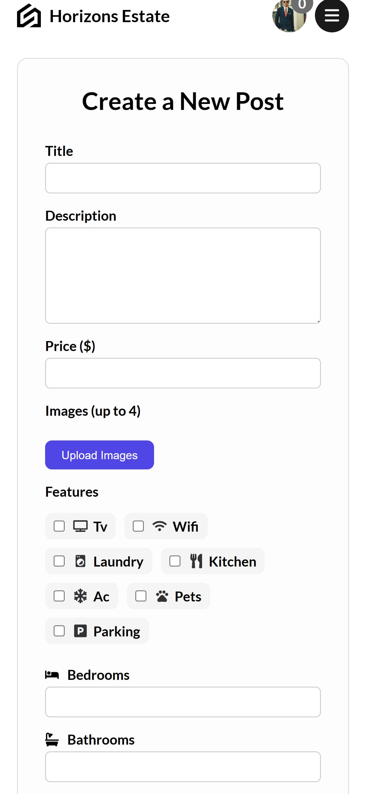

# 🏘️ Horizons Estate

A responsive fullstack real estate platform built with React, Express, MongoDB, and Prisma. It includes advanced property filtering, real-time messaging, interactive map integration, image galleries, and complete user profiles.

---

## 📸 Screenshots

### 💻 Desktop View

### 📱 Mobile View

| Room                                                         | Search                                                         | Map                                                         | Description                                                         | Form                                                         |
| ------------------------------------------------------------ | -------------------------------------------------------------- | ----------------------------------------------------------- | ------------------------------------------------------------------- | ------------------------------------------------------------ |
|  |  |  |  |  |

## 🚀 Features

### 🔐 Authentication

- Register / Log in with secure JWT authentication
- After login, users get access to:
  - Profile page with editable info
  - Chats with other users
  - Listed properties and favorites

### 🏠 Property Listings

- View all listings with:
  - Price, type, location, description, photos
- **Dedicated detail page** for each property
- Custom-built image slider with multiple photos

### 🗺️ Interactive Map

- Map built with **React Leaflet**
- Pins show the location of properties
- Clickable markers with property info

### 🧠 Smart Filters

- Filter properties by:
  - Location, type, price, amenities, and more

### 💬 Real-Time Chat

- Powered by **Socket.IO**
- One-to-one messaging with:
  - Instant delivery
  - Unread message notification badges

### ⭐ Favorites

- Add or remove properties from favorites
- Favorites persist in the database per user
- Quick access on profile page

### 📸 Create Property Listings

- Advanced listing form with:
  - Photo upload (via Cloudinary)
  - Address input with geocoding
  - Amenities and nearby places with distance
- Built-in validation using **Zod**

### 👤 User Profile

- View and update user info
- Manage:
  - Your posted listings
  - Chats
  - Favorites

### 📱 Responsive Design

- Fully responsive for desktop, tablet, and mobile
- Custom UI with **SCSS**

---

## 🧰 Tech Stack

### 🧠 Frontend (Vite + React)

- ⚛️ React 19
- 📦 Zustand for state management
- 🧭 React Router 7
- 🎯 React Select for filters
- 🗺️ React Leaflet for map
- 💬 Socket.IO Client
- ✍️ SCSS for styling
- 🧪 Zod for validation
- ⏰ timeago.js for timestamps

### 🌐 Backend (Express)

- ⚙️ Node.js + Express 5
- 🔐 JSON Web Tokens for auth
- 🧂 bcrypt for hashing
- 📁 cookie-parser
- 🌱 Prisma ORM (MongoDB)
- 🧪 Zod for validation
- 🌳 dotenv for environment vars

### 💬 Real-Time Communication

- 📡 Socket.IO (Server + Client)

### 🗃️ Database

- 🍃 MongoDB (via Prisma)
